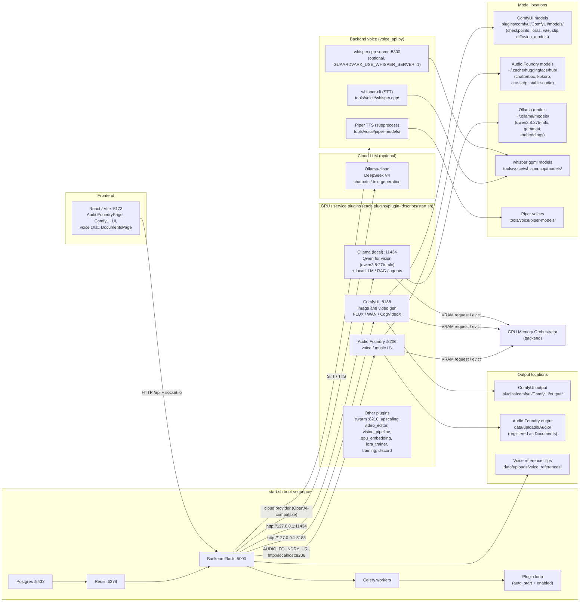

# Guaardvark Generation System — Block Diagram

How the generation stack boots (`./start.sh`), how requests flow, and where
models + outputs live.

## Mermaid diagram



## ASCII fallback

```
                        ┌──────────────────────────────────────────────┐
                        │              ./start.sh boot                 │
                        │  Postgres:5432 → Redis:6379 → Flask:5000     │
                        │  → Celery workers → plugin loop              │
                        └──────────────────────────────────────────────┘
                                          │
        ┌─────────────────────────────────┼──────────────────────────────────┐
        │                                 │                                  │
   ┌────▼─────┐                    ┌──────▼──────┐                    ┌──────▼──────┐
   │  ComfyUI │                    │Audio Foundry│                    │   Ollama    │
   │  :8188   │                    │   :8206     │                    │  :11434     │
   │ img/video│                    │ voice/music │                    │ Qwen vision │
   └────┬─────┘                    │ /fx         │                    │ (qwen3.8:   │
        │                          └──────┬──────┘                    │  27b-mlx)  │
        │                                 │                          └──────┬──────┘
        │                                 │                                 │
   ┌────▼──────────────┐          ┌───────▼──────────────┐          ┌───────▼────────┐
   │ models/           │          │ ~/.cache/huggingface │          │ ~/.ollama/models│
   │ ComfyUI/models/   │          │ /hub/ (chatterbox,   │          │ (qwen3.8:27b-  │
   │ (ckpt, lora, vae) │          │  kokoro, ace-step,   │          │  mlx, gemma4,  │
   └────┬──────────────┘          │  stable-audio)      │          │  embeddings)   │
        │                         └───────┬──────────────┘          └─────────────────┘
        │                                 │
   ┌────▼──────────────┐          ┌───────▼──────────────┐
   │ output/           │          │ data/uploads/Audio/  │
   │ ComfyUI/output/   │          │ (Documents)          │
   └───────────────────┘          └──────────────────────┘

   Cloud LLM (optional):
     Ollama-cloud  DeepSeek V4  →  chatbots / text generation
     (backend routes via OpenAI-compatible cloud provider)

   Backend voice (voice_api.py):
     whisper-cli (STT)  tools/voice/whisper.cpp/models/ggml-*.bin
     whisper.cpp server :5800  (optional, GUAARDVARK_USE_WHISPER_SERVER=1)
     Piper TTS          tools/voice/piper-models/*.onnx

   All plugins share the GPU Memory Orchestrator (VRAM request/evict).
```

## Key facts

| Component | Port | Started by | Models | Output |
|-----------|------|-----------|--------|--------|
| Backend Flask | 5000 | `start.sh` | — | — |
| ComfyUI (img/video) | 8188 | `plugins/comfyui/scripts/start.sh` | `plugins/comfyui/ComfyUI/models/` | `plugins/comfyui/ComfyUI/output/` |
| Audio Foundry (voice/music/fx) | 8206 | `plugins/audio_foundry/scripts/start.sh` | `~/.cache/huggingface/hub/` | `data/uploads/Audio/` |
| Ollama (local, Qwen vision) | 11434 | `start.sh` (systemd / `ollama serve`) | `~/.ollama/models/` (qwen3.8:27b-mlx, gemma4, embeddings) | — |
| Ollama-cloud (DeepSeek V4) | — | backend cloud provider (OpenAI-compatible) | remote | — |
| whisper (STT) | — / 5800 | `start.sh` (optional server) | `tools/voice/whisper.cpp/models/` | — |
| Piper (TTS) | — | `voice_api.py` subprocess | `tools/voice/piper-models/` | — |

- **Local Ollama** runs **Qwen** for vision (`qwen3.8:27b-mlx`, the preferred
  vision-capable model for character generation) plus local LLM / RAG / agents.
- **Ollama-cloud** (optional) serves **DeepSeek V4** for chatbots and other text
  generation, routed through the backend's OpenAI-compatible cloud provider.
- **Audio Foundry** uses two sibling venvs: `venv/` (dispatcher + voice + fx) and
  `venv-music/` (ACE-Step only, driven via subprocess).
- **`AUDIO_FOUNDRY_URL`** (`.env`) points the backend at the Audio Foundry
  plugin — default `http://localhost:8206`, overridable for a remote host.
- **whisper** is STT (speech→text), **not** part of Audio Foundry's generation.
- **Piper** is an alternative local TTS engine in the backend, separate from
  Audio Foundry's Chatterbox/Kokoro.
