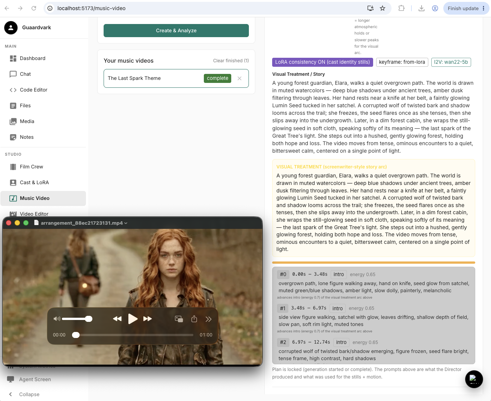

# Music Video — How to Use (with "The Last Spark Theme" example)

This guide walks through creating and rendering a **Music Video** in Guaardvark, using
**"The Last Spark Theme"** as a concrete worked example, including realistic render-time
estimates measured on an Apple-Silicon (MPS) machine.




---

## 1. What a Music Video is

A Music Video takes an uploaded **song** and produces a video cut to it:

1. **Analyze** the song → the Director (a small LLM) splits it into **cuts** (clips) with
   per-cut visual prompts, timed to the music's energy.
2. **Review & approve** the cut plan (optionally generate storyboard thumbnails first).
3. **Generate** each clip: a **keyframe still** (character identity) → **Wan I2V** animates it.
4. **Assemble** the clips + the song into the final video.

---

## 2. Prerequisites

- **ComfyUI plugin** running (port 8188) — `./start.sh` launches it.
- **Video models** installed (via **Manage Video Models**):
  - `wan22-5b` (Wan 2.2 TI2V-5B) — **recommended on Apple Silicon/MPS** (single 5B model, no offload).
  - `wan22-vae` + `wan-umt5` (auto-pulled with `wan22-5b`).
  - `wan22-14b-i2v` — higher quality but heavy (14B MoE, CUDA-oriented; slow on MPS).
  - `cogvideox-5b-i2v` — lighter alternative.
- **Z-Image Turbo** (for keyframe stills) registered in ComfyUI — `comfyui_installed_engines()` should report `['zimage']`.
- **Character LoRA** (for identity) linked into ComfyUI's `loras/` dir (auto via `GUAARDVARK_ZIMAGE_USE_COMFYUI=1`).
- **Audio Foundry** plugin up (port 8206) for assembly.

> **Model installs** land in `~/ComfyUI-Shared/models` when `GUAARDVARK_COMFYUI_DIR` is set
> (shared with Comfy Desktop). If a download hangs at 0 bytes, set `HF_HUB_DISABLE_XET=1` in
> `.env` and restart the backend (see `docs/GUAARDVARK_GUIDE.md` §7).

---

## 3. Step-by-step

### 3.1 Create the music video
1. Open the **Music Video** page.
2. **Upload a song** (WAV/MP3).
3. Fill in the **treatment** (the creative brief) and pick settings:
   - **I2V / Animation Model** — choose `wan22-5b` (MPS-friendly) or `wan22-14b-i2v`.
   - **Keyframe model** — `from-lora` (uses the character LoRA for identity) or `flux-schnell`/`sdxl`.
   - **LoRA consistency** — on to bake cast identity into keyframes.
4. Click **Create**.

### 3.2 Analyze
The backend analyzes the song and the Director produces a **cut plan** (per-cut prompts +
timing). This is fast (LLM-only, no GPU).

### 3.3 Review the plan (approval panel)
At the **awaiting_approval** stage you can:
- Edit per-cut prompts / style / treatment.
- **Generate Storyboards** to preview thumbnails.
- **Change the I2V model** from the approval panel's **I2V / Animation Model** dropdown
  (persists to the mv's settings; used when you Approve & Generate).
- Hit **Approve & Generate Video** to start rendering.

### 3.4 Render
Each clip renders as: **keyframe still (Z-Image)** → **Wan I2V** animation → saved clip.
Clips render one at a time (with a short GPU cooldown between them), then the **assembler**
muxes clips + the song into the final video.

---

## 4. Example: "The Last Spark Theme"

- **Song:** uploaded WAV.
- **Cuts:** **15 clips** (intro → build → drop → outro).
- **Models:** `i2v_model = wan22-5b`, `keyframe_model = from-lora` (Elara LoRA).
- **Stage:** `awaiting_approval` → `generating` → `assembling` → `complete`.

### Measured render speed (Apple Silicon / MPS, `wan22-5b`)

| Stage | Steps | Speed | Time |
|---|---|---|---|
| Keyframe still (Z-Image) | 45 | ~3.35 s/it | **~2.9 min** |
| Wan 5B I2V sampling | 25 | ~10.8–11.3 s/it | **~4.6 min** |
| + model load / VAE decode / combine | — | — | ~1–2 min |
| **Per clip total** | | | **~8–10 min** |

**Total for 15 clips: ~2 to 2.5 hours** (+ ~1–2 min assembly).

> The backend's stored estimate (~18 min / 75 s per clip) is **optimistic** and not realistic
> on MPS. Use the measured ~8–10 min/clip above for planning.

### Time by model choice (per clip, MPS)

| Model | Per-clip estimate | Notes |
|---|---|---|
| `wan22-5b` | ~8–10 min | Recommended on MPS — single 5B, no offload |
| `wan22-14b-i2v` | ~30–40+ min | 14B MoE, CUDA-oriented; heavy CPU-offload on MPS |
| `cogvideox-5b-i2v` | ~5–8 min | Lighter alternative |

---

## 5. Monitoring & resuming

- **Progress:** the Music Video page shows per-clip progress; `/api/jobs/active` and the
  unified progress system track the render.
- **ComfyUI:** `logs/comfyui.log` shows the sampling progress bars (`it/s`).
- **Resumable:** the clip generator is crash-safe — it skips clips already `done` on disk and
  resumes from the first incomplete one. A render interrupted by sleep/shutdown picks up
  where it left off.

### Manual resume after a ComfyUI outage

If the render fails with `ComfyUI not reachable at http://127.0.0.1:8188`, ComfyUI went down
mid-render. Completed clips are preserved; you can resume from the first incomplete one:

```bash
# 1) Check if ComfyUI is up (200 = up, 000/refused = down)
curl -s -m3 http://127.0.0.1:8188/ -o /dev/null -w "%{http_code}\n"

# 2) If down, restart it and wait until it's back
bash plugins/comfyui/scripts/stop.sh
bash plugins/comfyui/scripts/start.sh
until curl -s -m2 http://127.0.0.1:8188/ -o /dev/null; do sleep 3; done; echo "ComfyUI up"

# 3) Resume the render (crash-resumable — skips done clips, then assembles when all done)
source backend/venv/bin/activate
GUAARDVARK_MODE=default python3 -c "from backend.celery_app import celery; celery.send_task('music_video.run_clip_generator', args=[2])"

# 4) Verify progress
PGPASSWORD=guaardvark psql -h localhost -U guaardvark -d guaardvark -t -A -c \
  "SELECT clips FROM music_videos WHERE id=2;" | \
  python3 -c "import sys,json;c=json.load(sys.stdin);print('done',sum(1 for x in c if x.get('status')=='done'),'/',len(c))"
```

> The render is safe to resume any number of times — completed clips are kept on disk and
> never re-rendered. If ComfyUI keeps dropping, investigate a crash/OOM or plugin-manager
> restart rather than just resuming.

---

## 6. Troubleshooting

| Symptom | Cause | Fix |
|---|---|---|
| ComfyUI `400 ... not in []` on a loader | Model not registered in the running ComfyUI | Restart ComfyUI so it rescans; install the model via Manage Video Models |
| Keyframe still fails `unet_name/clip_name/vae_name ... not in []` | Z-Image models not registered | Add `extra_model_paths.yaml` bridging `~/ComfyUI-Shared` and restart ComfyUI |
| Character identity not applied | LoRA not linked into ComfyUI `loras/` | Ensure `GUAARDVARK_ZIMAGE_USE_COMFYUI=1` (auto-links) or symlink manually |
| Model download hangs at 0 bytes | HF Xet CDN unreachable | Set `HF_HUB_DISABLE_XET=1` in `.env`, restart backend |
| Render very slow on MPS | Using the 14B A14B model | Switch to `wan22-5b` (approval-panel dropdown) |

---

## 7. Related docs

- `docs/GUAARDVARK_GUIDE.md` §7 — ComfyUI shared-models setup, MPS-friendly vs 14B, `HF_HUB_DISABLE_XET`.
- `docs/CHARACTER_GENERATION.md` — Z-Image keyframes + LoRA identity.
- `docs/GENERATION_DIAGRAM.md` — generation stack / model locations.
- `ISSUES.md` — ComfyUI upgrade + known issues.


