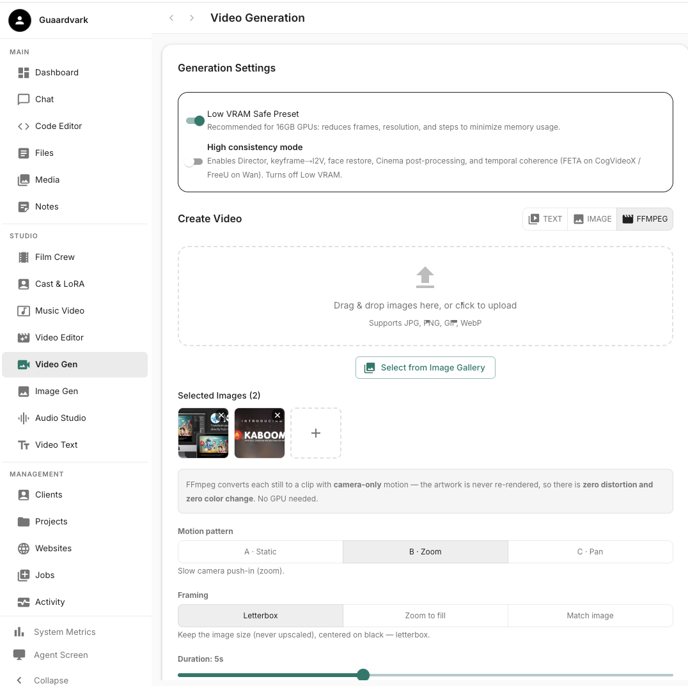
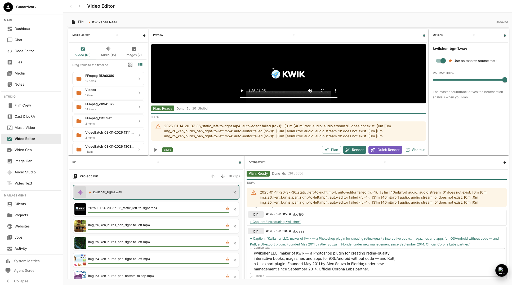

# FFmpeg still video (stills → camera-motion clips)

For images that must stay **pixel-perfect** (picture-book thumbnails, logos,
infographics), use **FFmpeg** instead of I2V. FFmpeg moves only the *camera* — it
never re-renders the artwork, so there is **zero distortion and zero color change**.



**Three patterns:**
| Key | UI label | Behavior |
|---|---|---|
| `static` | **A · Static** | Holds the frame — no movement, pixel-perfect. |
| `ken_burns_zoom` | **B · Zoom** | Slow camera push-in (zoom). |
| `ken_burns_pan` | **C · Pan** | Slow camera pan — pick a direction (left/right/top/bottom). |

**Web UI (`/video`):** click the **FFmpeg** toggle (🎬 icon, next to Image) → upload
images → pick a pattern (A/B/C), duration (2–10s), FPS (24/25/30), resolution
(480p/720p/1080p) → **Generate FFmpeg Clips**. Results return instantly; each clip is
saved to the **Media Library** (Videos) with a Download link.

**Output framing (no distortion, no upscaling):** every clip is produced at the
chosen resolution with the image **fitted inside the frame** — small images keep
their native size (they are **never** upscaled), and images larger than the frame are
scaled down, always **preserving proportions**, centered on a **black** background.
**Transparent PNGs are flattened onto black**, so fully-transparent regions come out
black (not white) — handy for logos and cut-out artwork without ugly white edges.

**Framing modes** (choose in the FFmpeg settings):
| Mode | Behavior |
|---|---|
| **Letterbox** (default) | Keep the image size (never upscaled), centered on black. |
| **Zoom to fill** | Scale the image to cover the whole frame and center-crop the overflow. |
| **Match image** | Output video size = the image's own size, clamped to a **min** (optional) and **max** (the Resolution setting). |

CLI: `--framing fit|cover|native` and `--min-size 480x270` (for `native`).

**CLI:**
```bash
python scripts/ffmpeg_stills.py images/*.png --pattern ken_burns_zoom --duration 5 \
  --width 1280 --height 720
```

**Focus point:** Zoom (and the pan fixed axis) accept a focus `--focus-x` / `--focus-y`
(`0–1` fraction, default `0.5` = center) so the camera stays centered on a chosen part
of the image (e.g. a character) while zooming. **Pan direction:** `--pan-direction
left-to-right|right-to-left|top-to-bottom|bottom-to-top|random` (default left-to-right).
`random` picks a different direction per image for batch variety. In the web UI, FFmpeg
mode hides all AI model settings (no model is needed).

**Full reference:** see `docs/FFMPEG_STILL_VIDEO.md`. Generated clips are `video` clips,
so they work directly in the Video Editor's **Plan** pipeline.

---

# Captions — manage, export/import, and edit

The Video Editor's **Plan** pipeline generates an AI caption for every arranged clip.
Captions are managed in a few places and can be exported to a human-editable **.srt**
subtitle file and edited in the **Code Editor** (or any text editor).



## Where captions live

- **Arrangement Preview** (Video Editor) — each clip that has a caption shows a
  **“Caption: ‘…’”** toggle. Expand it to edit per-clip caption **text**, **position**
  (9 presets: top/bottom/left/right/center), **size** (px), **text color**, and
  **background color**.
- **Caption defaults** (**OptionsPanel**, right side) — set a single **Default text**
  (overrides the AI auto-captions), **Text color**, **Background**, and **Size** that are
  applied to **every** clip when you hit **Plan**. This is the fast way to give the whole
  video one consistent caption style (brand color, transparent background, etc.).

## Export captions → .srt

1. Run **Plan** so the arrangement has captions.
2. Use the **Caption filename** field (next to the captions buttons) — it auto-fills to
   **`<projectName>_captions`**, so naming your project `Kwiksher` exports
   `Kwiksher_captions.srt`. You can type a custom name instead.
3. Click **Export captions**. The file is saved to **Files → Captions** as an SRT
   Document (`.srt` appended automatically).

## Import captions

Click **Import captions** and enter a caption **file path** (or document id) of an existing **SRT** file. Its captions are applied to the arrangement clips, matched by
timecode overlap. Useful after you've hand-edited captions and re-imported them.

## Editing captions in the Code Editor

The exported `.srt` is a normal text file, so you can edit it in the **Code Editor**
(page `/code-editor`):

- **Easy way** — right after **Export captions**, click the green **“Edit captions”**
  button; it opens the exported `.srt` directly in the Code Editor.
- **From Files** (`/documents`, Files → Captions) — **double-click** the `….srt` to open
  the built-in editor, then use its **“Open in Code Editor”** button; or **right-click**
  the file → **“Open in Code Editor”**.

> Captions are stored in **SRT** format (numbered blocks with `HH:MM:SS,mmm -->`
> timecodes). A `.srt` is deliberately plain text so you can edit timecodes and wording
> in any editor and re-import the result. `.srt` files open with plain-text highlighting
> in the Code Editor.

---

# Audio prompt options (children's book brand)

## Option 1 — Playful & whimsical (best fit)
**Genre:** `Pop` · **Mood:** `Playful`, `Uplifting`, `Whimsical` · **Instruments:** `Piano`, `Strings`, `Bells`
**Additional details:**
> `"whimsical and playful, like a storybook come to life, twinkling music-box bells, bouncy piano, gentle strings, magical and joyful, light and airy, feels like turning the pages of a children's picture book"`

## Option 2 — Bright & bouncy (energetic, kid-friendly)
**Genre:** `Pop` · **Mood:** `Energetic`, `Happy`, `Playful` · **Instruments:** `Synth`, `Drums`, `Bells`
**Additional details:**
> `"bright and bouncy, cheerful cartoon energy, bouncy synth melody, light percussion, sparkly bells, upbeat and fun, like a happy animated short for kids, warm and inviting"`

## Option 3 — Magical adventure (storybook feel)
**Genre:** `Cinematic` · **Mood:** `Magical`, `Uplifting`, `Whimsical` · **Instruments:** `Strings`, `Piano`, `Bells`
**Additional details:**
> `"magical and adventurous, like a storybook journey, sweeping strings, gentle piano, sparkling chimes, wonder and delight, soft and dreamy with a joyful lift, perfect for an animated children's tale"`

## Option 4 — Short & punchy (if you want a snappy 15–20s promo)
**Genre:** `Pop` · **Mood:** `Playful`, `Energetic` · **Instruments:** `Synth`, `Bells`, `Drums`
**Additional details:**
> `"short, punchy, and fun, playful cartoon jingle, bouncy and bright, sparkly bells and light drums, cheerful and memorable, like a kids' app intro"`

**Recommendation:** **Option 1** — it matches the "storybook come to life" brand voice
("Change how people experience stories"). Set **Duration** to 30s, **Instrumental only**
ON, and turn on **Polish with AI**.

---

# Visual style prompts (pair with the audio)

## Pair with Option 1 (Playful & whimsical)
**Visual style / prompt:**
> `"whimsical storybook animation, soft watercolor and crayon textures, warm pastel palette with deep blue #003388 and orange #ffa902 accents, gentle hand-drawn characters, floating sparkles and twinkling stars, magical and joyful, like a children's picture book come to life"`

**Visual Treatment / Short Story:**
> `"A blank page opens like a book. A little fox character drawn in crayon steps out and begins to color the world around it — trees, a castle, a river. Each page turn brings a new scene to life with a gentle bounce. The fox waves as the Kwiksher logo appears, and the tagline 'Change how you experience stories' fades in."`

## Pair with Option 2 (Bright & bouncy)
**Visual style / prompt:**
> `"bright cartoon animation, bold clean shapes, cheerful saturated colors with blue #003388 and orange #ffa902, bouncy character motion, confetti and sparkles, energetic and fun, like a happy animated kids' app"`

**Visual Treatment / Short Story:**
> `"A cheerful robot taps a tablet and a storybook springs open. Pages flip fast with a bouncy rhythm, each one a colorful scene — a rocket launch, a dancing dinosaur, a rainbow. The robot gives a thumbs up as the logo pops in with a bounce."`

## Pair with Option 3 (Magical adventure)
**Visual style / prompt:**
> `"magical storybook animation, dreamy soft lighting, glowing lanterns and fireflies, rich deep blues with warm orange highlights, sweeping cinematic camera, wonder and delight, like an animated fairy tale"`

**Visual Treatment / Short Story:**
> `"A child blows on a dandelion and the seeds drift into a glowing storybook. The camera sweeps through a magical forest as pages turn — a dragon, a hidden castle, a starry sky. The seeds gather into the Kwiksher logo as the story gently closes."`

## Pair with Option 4 (Short & punchy)
**Visual style / prompt:**
> `"punchy cartoon motion graphics, bold flat shapes, playful squash-and-stretch, bright blue #003388 and orange #ffa902, quick snappy cuts, sparkles and stars, fun and memorable, like a kids' app intro"`

**Visual Treatment / Short Story:**
> `"Quick montage: a crayon draws a line, a page flips, a character pops up and waves, a rocket blasts off. Fast snappy cuts synced to the beat, ending on the Kwiksher logo with a star burst."`

**Settings to match (on `/music-video`):**
- **Director planning mode** → `Narrative continuity` (keeps the character consistent across cuts).
- **Use Director for distinct per-cut prompts** → ON.
- **I2V / Animation Model** → `Wan 2.2 5B TI2V` (MPS-friendly default).