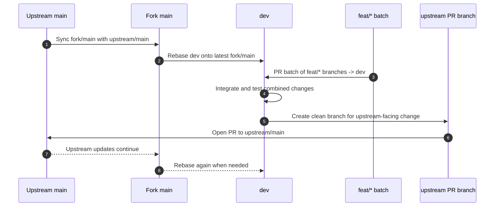
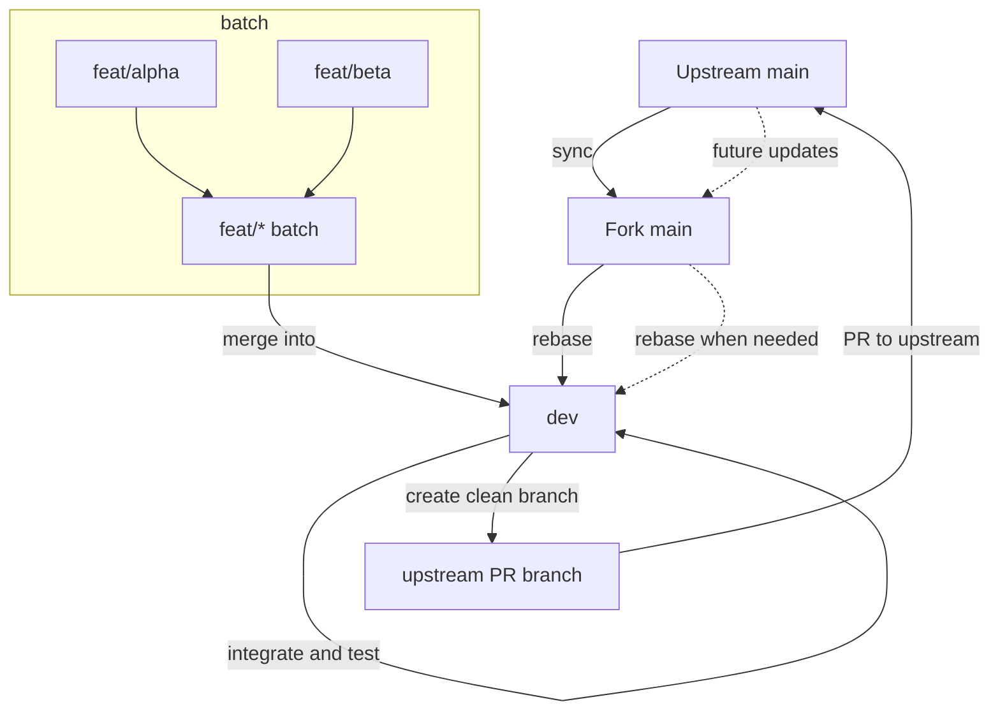

# Fork Branch Workflow

This diagram shows the recommended fork workflow:

- keep `main` in the fork synced with upstream `main`
- use `dev` as the fork-internal integration branch
- group related `feat/*` branches into a batch, merge the batch into `dev`, run one integration test, then delete the feature branches unless you expect immediate follow-up work
- create a clean upstream-facing branch only when the change set is ready, and delete it after the upstream PR is merged or closed

Branch graph view:

